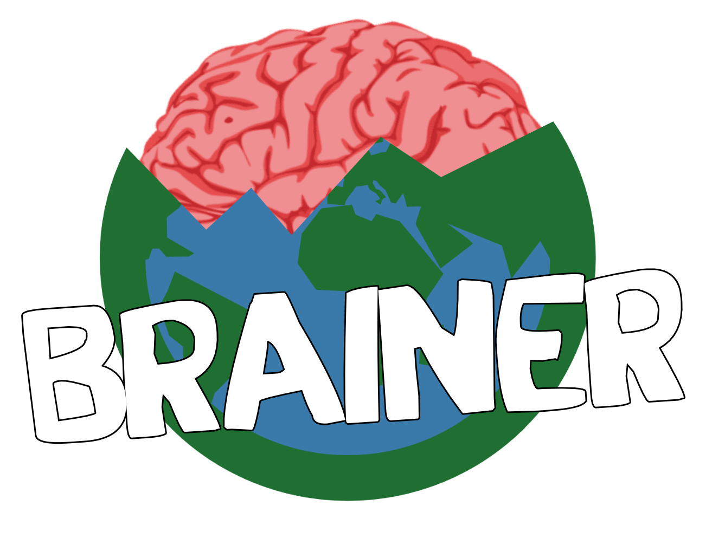

> [!IMPORTANT]
> The project is still a work in progress.

Brainer is a unoficial port of Rayman Raving Rabbids TV Party for PC (Windows, Linux, Macos) and Mobile (Android and IOS) used NWiiRecomp
This project does not use game assets, you neeed a legal Rayman Raving Rabbids TV Party (Europe, USA) copies to play it
# Features

# Credits
* [NWiiRecomp](https://github.com/BlackLineInteractive/NWiiRecomp) for transform the PowerPC code to C++

No AI used, 100% Human code and assets

Rabbids and Rayman was trademark deposed by Ubisoft

This project is not affiliated with Ubisoft

